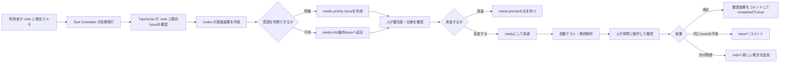

# AI改善ループの全体像

この文書は、日常の不満を`.todo`に書いてから、GitHub Issueとして整理し、実装・確認・完了まで進める流れを説明します。
細かいコマンドや設定は[AI todo triageの手順書](ai-triage.md)を参照してください。

## まず覚える流れ



重要なのは、AIがIssueを整理することと、人が採用・優先度・完了を決めることを分ける点です。

## それぞれの役割

| 担当     | やること                                                          | やらないこと                             |
| -------- | ----------------------------------------------------------------- | ---------------------------------------- |
| 利用者   | `.todo`へ不満を普段の言葉で書く。実装後に実際に試す               | 原因やIssue形式を最初から考え込む        |
| 自動処理 | 既存Issueを検索し、コードやテストを調査してIssue案を作る          | コード変更、優先度決定、Issueの自動close |
| 人       | Issueの重複・内容・優先度・仕様を確認し、実装担当と最終確認を行う | AIの調査結果を無確認で採用する           |

## 利用者がすること

### 1. `.todo`へ気軽に書く

構造化しなくて構いません。例えば次のような散文で十分です。

```text
スレ一覧からスレを開いたとき、たまに表示位置がずれる気がする。再現条件はまだ不明。
```

原因、優先度、再現手順、修正案を無理に書く必要はありません。AIがリポジトリと既存Issueを調べ、分かる範囲を補完します。

### 2. 自動処理の結果を見る

定期実行を登録していれば、通常は何もしなくて構いません。手動で確認する場合は次を使います。

```powershell
# Issueを作らず、調査レポートだけ作る
pnpm triage:todo

# 調査結果をIssue作成まで反映する
pnpm triage:todo -- --apply
```

新規の`needs-priority` Issueは1回につき最大3件です。意図不明の項目がある場合は、別に集約Issueが1件作成または更新されます。
結果は次の場所に保存されます。

- `debug/triage/todo-triage.json`: Codexの調査結果
- `debug/triage/codex.log`: Codexの実行ログ
- `debug/triage/scheduler.log`: Task Scheduler経由の実行ログ

### 3. Issueを人が判断する

`needs-priority`は「調査済みだが、まだ人が優先度を決めていない」状態です。
実装してよいと判断したIssueだけを`ready`にします。

複数のIssueが`ready`の場合は、更新日時に左右されないようIssue番号が最小の1件だけを開始します。
AI専用worktreeの待機ブランチから次のコマンドを実行すると、対象Issueを`in-progress`へ移し、
`develop`ベースでLive変更を含まない待機ブランチから`ai/issue-<番号>`ブランチへ切り替えます。

```powershell
pwsh -NoProfile -ExecutionPolicy Bypass -File .\scripts\start-ready-issue.ps1
```

worktreeがdirtyな場合や同名ブランチが既にある場合は、既存作業を保護するため何も上書きせず停止します。
`pnpm-lock.yaml`が前回準備時と同じなら`vp install`も省略します。

Task Schedulerの定期実行も同じ処理を呼び出します。`ready`があれば最小番号のIssueを自動的に
claimしてCodexを起動し、実装・検査・コミット・Issueコメントまで行います。成功時は
`needs-human-test`へ移してIssueブランチをpushしてから待機ブランチへ戻ります。トリアージが
`.todo`へ追加したIssueマーカーも`automation/ai-workspace`へコミット・pushします。途中失敗時や
push失敗時はIssueブランチを保持し、次回の定期実行で同じIssueを再開します。

`.todo`はAI運用ブランチを正本とし、実装Issueブランチでは編集しません。人が内容を追加する場合も
AI worktreeの`.todo`へ書き、定期トリアージがマーカー追加後にpushします。

既存Issueへ再現情報や仕様の回答を追記した場合は、`needs-retriage`を付けます。次回の定期実行が本文・コメント・最新コードを再調査し、結果をIssueコメントへ追加します。調査後は、判断可能なら`needs-priority`、まだ情報不足なら`needs-info`へ自動的に戻ります。

意図不明のメモは、個別Issueを増やさず`[triage] Unclear todo items`へ集約されます。
質問に答えられる場合は、そのIssueへコメントしてください。

## Issueの進み方

```text
needs-priority
    ↓ 人が採用・仕様確認
ready
    ↓ 実装開始
in-progress
    ↓ 実装と自動確認が完了
needs-human-test
    ↓ 人が実際に操作
completedでclose / not plannedでclose / Issueへ追加コメント
```

追加情報から再調査する場合は、次の経路も利用できます。

```text
needs-info / needs-priority
    ↓ 人がIssueへ情報を追記してneeds-retriageを付与
needs-retriage
    ↓ 定期実行が再調査結果をコメント
needs-priority / needs-info
```

### 既存Issueに紐づいている場合

`.todo`に`<!-- issue: #123 -->`が付いている項目は、新しいIssueになりません。自動処理はリンク先のIssueを再確認します。

- まだ有効そうなら、そのまま扱う
- すでに直っていそうなら`review-existing`を付けて人に確認を求める
- 人が確認してから`completed`または`not planned`でcloseする

AIは既存Issueを自動closeしません。

### 実装後に不満が残った場合

- 元のIssueの完了条件に関する不満なら、そのIssueへコメントする
- 別の問題なら、`.todo`へ新しい散文として書く
- 実際に満足したら、操作結果をIssueへコメントしてから`completed`でcloseする

## 自動処理の安全策

- 最初にopen/closed両方の既存Issueを確認し、重複作成を避ける
- `needs-priority`も重複確認の対象にする
- 意図不明の項目は1つのIssueへ集約する
- `.todo`の原文は変更せず、Issue番号のコメントだけを追記する
- 同時実行時は`debug/triage/triage.lock`で片方をスキップする
- `.todo`とIssuesが前回から変わらなければCodexを起動しない
- 強制的に再実行するときだけ`--force`を使う
- AIが作成したIssueにはAIによる整理であることを明記する
- triageコマンド自体はコード変更、commit、push、Issueの自動closeを行わない（定期runnerの運用commit・実装pushは別途行う）

## Windowsでの自動実行

登録・削除は次のスクリプトで行います。既定では30分間隔です。

```powershell
# 登録直後にも1回実行する
pwsh -NoProfile -ExecutionPolicy Bypass -File .\scripts\register-triage-task.ps1 -RunImmediately

# 登録内容だけ確認する
pwsh -NoProfile -ExecutionPolicy Bypass -File .\scripts\register-triage-task.ps1 -WhatIf

# 削除する
pwsh -NoProfile -ExecutionPolicy Bypass -File .\scripts\unregister-triage-task.ps1
```

GitHub APIへ接続するため、`GITHUB_TOKEN`または`GH_TOKEN`をWindowsのユーザー環境変数に設定します。
トークンはTask Schedulerの引数やリポジトリへ保存しません。タスクはログイン中の現在ユーザーとして実行されます。

## 関連ファイル

| ファイル                             | 役割                                   |
| ------------------------------------ | -------------------------------------- |
| `.todo`                              | 利用者が不満を自由に書く入力欄         |
| `scripts/triage-todo.ts`             | `.todo`を調査し、Issue作成まで行う本体 |
| `scripts/triage-todo.schema.json`    | Codexの出力形式を検証するスキーマ      |
| `scripts/register-triage-task.ps1`   | Windows Task Schedulerへの登録         |
| `scripts/unregister-triage-task.ps1` | Windows Task Schedulerからの削除       |
| `docs/guides/ai-triage.md`           | コマンドと運用の詳細手順               |
| `AGENTS.md`                          | AIが守る改善ループのルール             |
